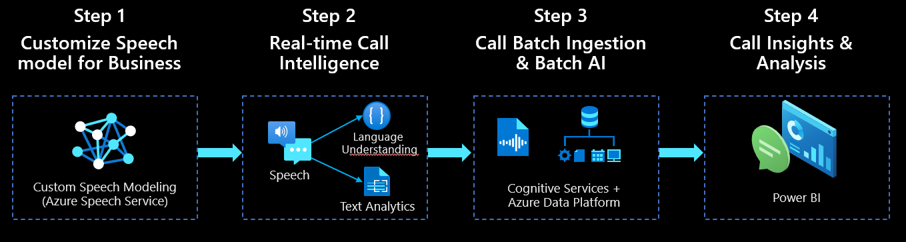

# Call Center Intelligence: Powered by Azure AI
 
 This is a sample solution for Call Center Intelligence powered by Azure AI. It shows how Azure AI services could be used both in real-time and batch scenarios for an Intelligent Contact Center.

 Below diagram depicts key components and Azure services used in this sample solution.

## Contents

Outline the file contents of the repository. It helps users navigate the codebase, build configuration and any related assets.

| Folder                              | Description                                |
|-------------------|--------------------------------------------|
| [azure-custom-speech](azure-custom-speech)              | Sample data and instructions to create custom transcription model using Azure Speech service (Step 1 in above diagram). This step produces a sample custom speech model. This step also enables speech logging to capture real-time call audio.                  |
| [azure-speech-streaming-reactjs](azure-speech-streaming-reactjs)    | Java Script applications that simulates real-time call intelligence (Step 2 in above diagram). This application also captures audio conversation that could be used in the next step for batch call analytics.             |
| [call-batch-analytics](call-batch-analytics)      | ARM template file and deployment guide for performing ingestion & batch analytics of calls using various Azure AI services (Step 3 in above diagram). This part of the solution can be used either with data output from step 2 OR using sample call recordings (if you have that).   |
| [powerbi](powerbi)                  | Template files and deployment guide for visualizing call insights using Power BI (Step 4 in above diagram).      |

## Prerequisites

* An existing [Azure Account](https://azure.microsoft.com/free/)
* Ensure you have [Node.js](https://nodejs.org/en/download/) installed. Required for `Step 2` only.
* Ensure you have [Power BI](https://powerbi.microsoft.com/en-us/downloads/) installed. Required for `Step 4` only.

## Dependencies

This solution is modular and some part of the solution can be used independently and some components depends on other steps to be completed. In summary, real-time and batch call analytics can be used independently. Below is a list of dependencies:
* Step 2 depends on Step 1 to be completed. Custom Speech model created in Step 1 is used in Step 2. Step 2 can be used without step 1 with minor code modifications (for advanced users only).
* Step 3 and Step 4 can be used independently, if you have sample call recordings. If you don't have sample call recordings, then use Step 2 to simulate business conversations and capture the recording that you could use in this step.

## Getting started

Follow the individual instructions for each step of the solution provided within above `Folders`.

